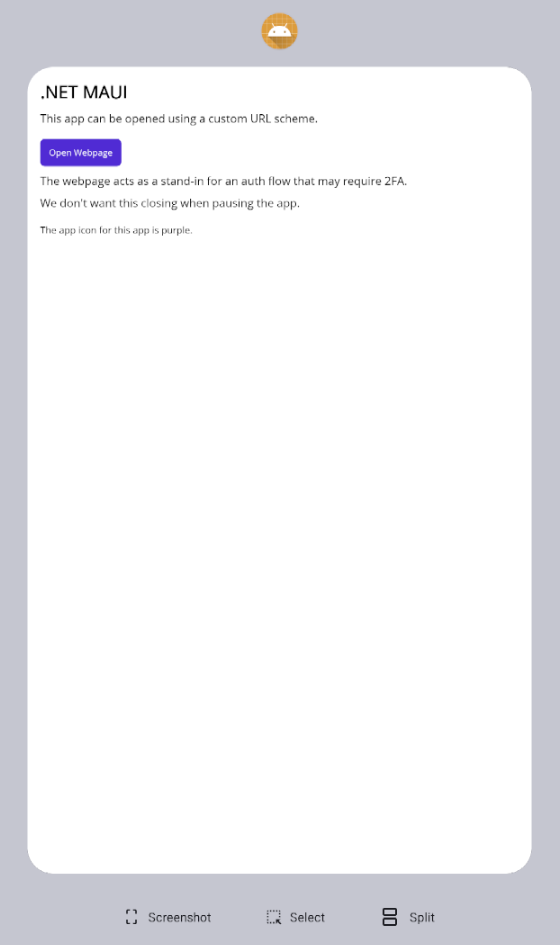
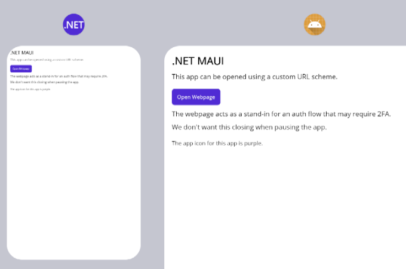

# Deep Linking Android

When setting up deep linking in a .NET MAUI Android app (using Android App Links), we encountered unexpected issues. Despite multiple attempts to resolve these problems, each solution presented its own challenges.

To identify whether the root cause was related to MAUI or Android itself, a native Android repro app was developed. Our findings revealed that many of the same issues exist in the native Android app.

The following scenarios outline the various implementation attempts, and what did or didn't work for each attempt.

#### Scenario 1: SingleTop (default)

> See Appendix A.1 for code to replace in the repro app projects to test this scenario.

When the LaunchMode is set to SingleTop, opening the deep link seems to open the repro apps within the originating app rather than as its own instance.

This can be seen by looking at the app icon in the app switcher. The app icon should be the default MAUI app icon, but instead has the app icon of the originating app.

Also, if an instance of the app is already in the background when the deep link is opened, it seems to open a second instance of the app.




---

#### Scenario 2: SingleTask

> See Appendix A.2 for code to replace in the repro app projects to test this scenario.

This fixes deep linking for our use case, opening the app in its own instance, and not creating any additional instances.

The issues with SingleTask occur for WebAuthenticator and any other webviews that open in their own activity.

If the app is paused and then resumed by:
 - tapping on the app in the app drawer
   - the webview will be closed
 - tapping on the app in the app switcher
   - the webview will still be open

WebAuthenticator closing when resumed is an issue for us for auth flows with 2FA where the user may need to pause the app to get an authenticator code.

---

#### Scenario 3: Deep linking activity

> See Appendix A.3 for code to replace in the repro app projects to test this scenario.

To get the best of both worlds this solution has an activity dedicated to handling deep links.
This activity is set to SingleTask and the MainActivity is set to SingleTop.

This seems to work fine in the native Android app.

It also seems to work in the MAUI app when using the .NET 9 new app template.

The below exception is thrown in the MAUI app when using the .NET 8 new app template:
```
System.InvalidOperationException: This window is already associated with an active Activity (DeepLinkingAndroidMaui.MainActivity). Please override CreateWindow on DeepLinkingAndroidMauiNet8.App to add support for multiple activities https://aka.ms/maui-docs-create-window or set the LaunchMode to SingleTop on DeepLinkingAndroidMaui.MainActivity.
```

**Next steps:** Try getting this fix working in our actual app which is on .NET 8 and has many references to MainPage.

---

#### Additional information

A custom URL scheme is being used as a stand-in for Android App Links in the repro apps.

Since many apps do not make URLs with custom schemes tappable i.e. SMS or Contacts on the Android Emulator, a separate helper app is included for deep linking to the repro apps.

> See the DeepLinkingHelper app.

## Appendix A

### 1. SingleTop (default)
This is how the repro apps are set up by default.

<details>
<summary>Hide/show section</summary>

### 1.1 MAUI application

#### 1.1.1 MainActivity.cs
```csharp
...

[Activity(
    Theme = "@style/Maui.SplashTheme",
    MainLauncher = true,
    LaunchMode = LaunchMode.SingleTop,
    ConfigurationChanges = ConfigChanges.ScreenSize | ConfigChanges.Orientation | ConfigChanges.UiMode | ConfigChanges.ScreenLayout | ConfigChanges.SmallestScreenSize | ConfigChanges.Density)]
[IntentFilter(
    [Intent.ActionView],
    Categories = [Intent.CategoryDefault, Intent.CategoryBrowsable],
    DataScheme = "hello")]
public class MainActivity : MauiAppCompatActivity
{
    protected override void OnCreate(Bundle? savedInstanceState)
    {
        base.OnCreate(savedInstanceState);
        
        Console.Write("OnCreate: ");
        Console.WriteLine(this.Intent?.GetStringExtra("data"));
    }

    protected override void OnNewIntent(Intent? intent)
    {
        base.OnNewIntent(intent);
        
        Console.Write("OnNewIntent: ");
        Console.WriteLine(intent?.GetStringExtra("data"));
    }
}

...
```

### 1.2 Native application

#### 1.2.1 AndroidManifest.xml
```xml
...

<activity
    android:name=".MainActivity"
    android:launchMode="singleTop"
    android:exported="true"
    android:theme="@style/Theme.DeepLinkingAndroidNative">

    <intent-filter>
        <action android:name="android.intent.action.MAIN" />
        <category android:name="android.intent.category.LAUNCHER" />
    </intent-filter>

    <intent-filter>
        <action android:name="android.intent.action.VIEW" />
        <category android:name="android.intent.category.DEFAULT" />
        <category android:name="android.intent.category.BROWSABLE" />
        <data android:scheme="hello" />
    </intent-filter>

</activity>

...
```
</details>

---

### 2. SingleTask

<details>
<summary>Hide/show section</summary>

### 2.1 MAUI application

Change LaunchMode to SingleTask in MainActivity.cs

### 2.2 Native application

Change LaunchMode to SingleTask in AndroidManifest.xml

</details>

---

### 3. Deep linking activity

<details>
<summary>Hide/show section</summary>

### 3.1 MAUI application

#### 3.1.1 MainActivity.cs
```csharp
...

[Activity(
    Theme = "@style/Maui.SplashTheme",
    MainLauncher = true,
    LaunchMode = LaunchMode.SingleTop,
    ConfigurationChanges = ConfigChanges.ScreenSize | ConfigChanges.Orientation | ConfigChanges.UiMode | ConfigChanges.ScreenLayout | ConfigChanges.SmallestScreenSize | ConfigChanges.Density)]
public class MainActivity : MauiAppCompatActivity
{
    protected override void OnCreate(Bundle? savedInstanceState)
    {
        base.OnCreate(savedInstanceState);
        
        Console.Write("OnCreate: ");
        Console.WriteLine(this.Intent?.GetStringExtra("data"));
    }

    protected override void OnNewIntent(Intent? intent)
    {
        base.OnNewIntent(intent);
        
        Console.Write("OnNewIntent: ");
        Console.WriteLine(intent?.GetStringExtra("data"));
    }
}

...
```

#### 3.1.2 DeepLinkingActivity.cs

Create the below activity.

```csharp
...

[Activity(
    NoHistory = true,
    LaunchMode = LaunchMode.SingleTask,
    Exported = true)]
[IntentFilter(
    [Intent.ActionView],
    Categories = [Intent.CategoryDefault, Intent.CategoryBrowsable],
    DataScheme = "hello")]
public class DeepLinkingActivity : Activity
{
    protected override void OnCreate(Bundle? savedInstanceState)
    {
        base.OnCreate(savedInstanceState);
        this.ForwardIntent();
    }

    protected override void OnNewIntent(Intent? intent)
    {
        base.OnNewIntent(intent);
        this.ForwardIntent();
    }

    private void ForwardIntent()
    {
        var newIntent = new Intent(this, typeof(MainActivity));
        
        newIntent.PutExtra("data", this.Intent?.Data?.LastPathSegment);
        newIntent.AddFlags(ActivityFlags.ClearTop | ActivityFlags.SingleTop);
        
        this.StartActivity(newIntent);
    }
}

...
```

### 3.2 Native application

#### 3.2.1 AndroidManifest.xml
```xml
...

<activity
    android:name=".MainActivity"
    android:launchMode="singleTop"
    android:exported="true"
    android:theme="@style/Theme.DeepLinkingAndroidNative">

    <intent-filter>
        <action android:name="android.intent.action.MAIN" />
        <category android:name="android.intent.category.LAUNCHER" />
    </intent-filter>

</activity>

<activity
    android:name=".DeepLinkingActivity"
    android:launchMode="singleTask"
    android:exported="true">

    <intent-filter>
        <action android:name="android.intent.action.VIEW" />
        <category android:name="android.intent.category.DEFAULT" />
        <category android:name="android.intent.category.BROWSABLE" />
        <data android:scheme="hello" />
    </intent-filter>

</activity>

...
```

#### 3.2.2 DeepLinkingActivity.kt

Create the below activity.

```kotlin
...

class DeepLinkingActivity : Activity() {
    override fun onCreate(savedInstanceState: Bundle?) {
        super.onCreate(savedInstanceState)
        forwardIntent()
    }

    override fun onNewIntent(intent: Intent?) {
        super.onNewIntent(intent)
        forwardIntent()
    }

    private fun forwardIntent() {
        val newIntent = Intent(this@DeepLinkingActivity, MainActivity::class.java)

        newIntent.putExtra("data", intent?.data?.lastPathSegment)
        newIntent.addFlags(Intent.FLAG_ACTIVITY_CLEAR_TOP or Intent.FLAG_ACTIVITY_SINGLE_TOP)

        startActivity(newIntent)
    }
}

...
```
</details>